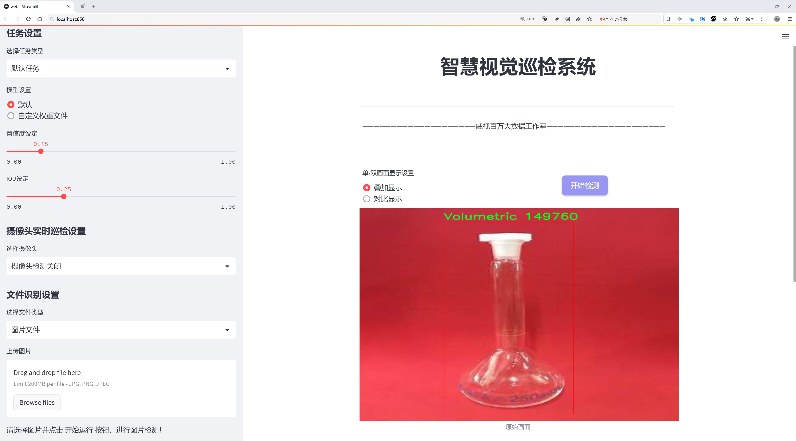
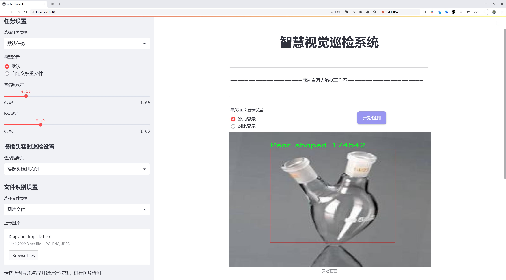
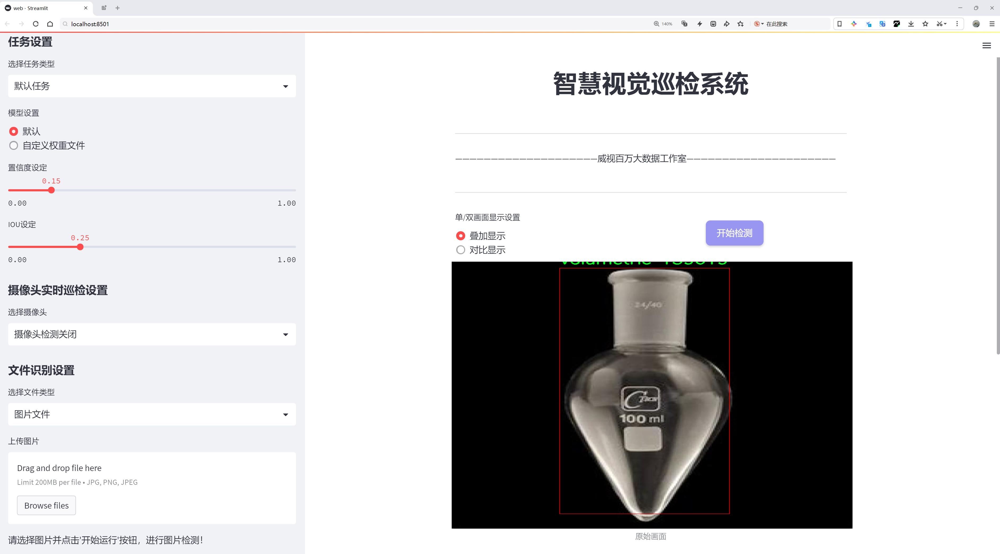
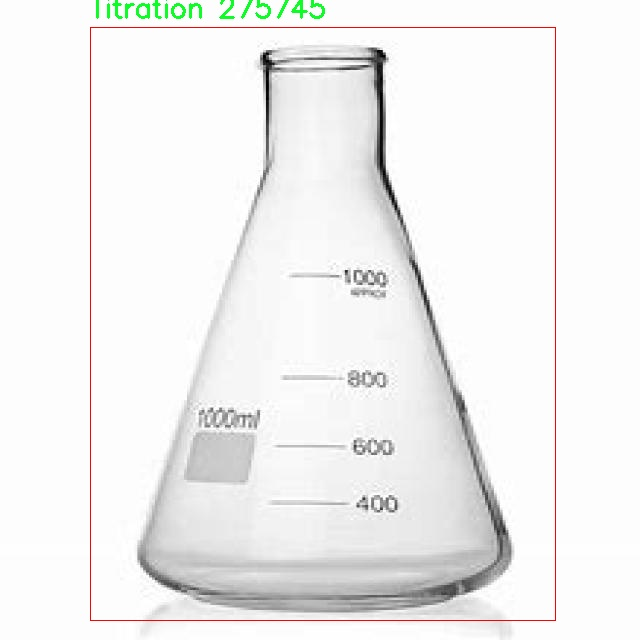
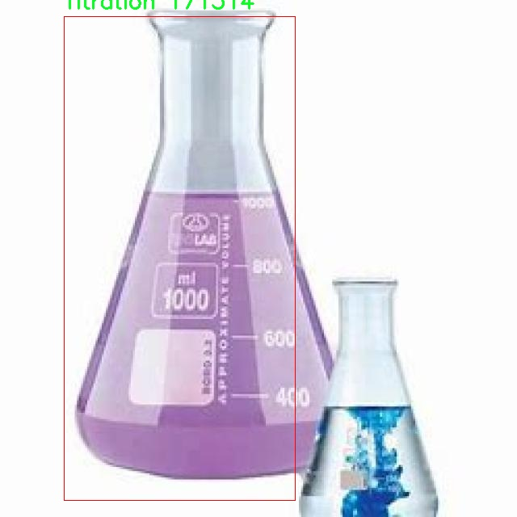
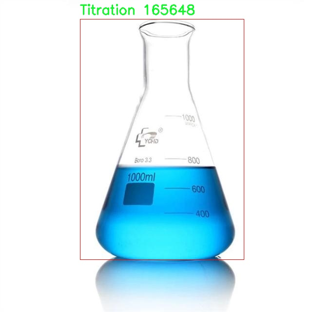
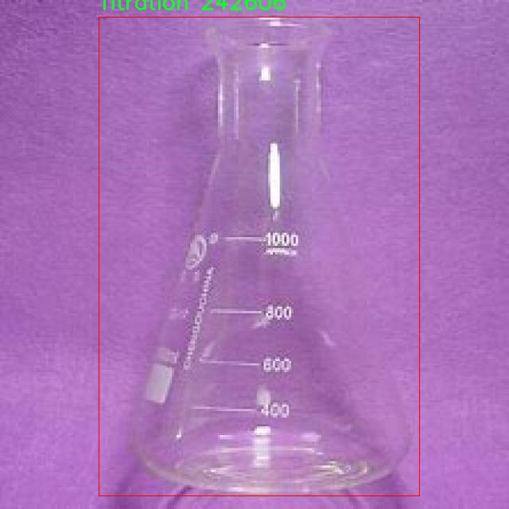
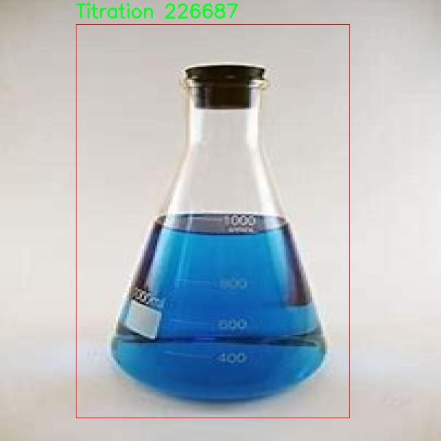

# 化学实验室器具识别检测系统源码分享
 # [一条龙教学YOLOV8标注好的数据集一键训练_70+全套改进创新点发刊_Web前端展示]

### 1.研究背景与意义

项目参考[AAAI Association for the Advancement of Artificial Intelligence](https://gitee.com/qunshansj/projects)

项目来源[AACV Association for the Advancement of Computer Vision](https://gitee.com/qunmasj/projects)

研究背景与意义

随着科学技术的迅猛发展，化学实验室的自动化和智能化水平不断提高，实验室器具的高效识别与管理成为提升实验效率和安全性的重要环节。传统的化学实验室器具识别方法多依赖人工识别，不仅耗时耗力，而且容易受到人为因素的影响，导致识别准确率低下。为了解决这一问题，基于计算机视觉和深度学习技术的自动识别系统逐渐成为研究热点。YOLO（You Only Look Once）系列模型以其快速和高效的特性，广泛应用于物体检测领域，尤其在实时性要求较高的场景中表现出色。

本研究旨在基于改进的YOLOv8模型，构建一个高效的化学实验室器具识别系统。我们使用的数据集包含1800张图像，涵盖了六类化学实验室器具，包括烧杯、梨形瓶、试管、滴定管、容量瓶以及未知类别。这些器具在化学实验中扮演着至关重要的角色，其准确识别不仅有助于实验操作的顺利进行，还能有效减少实验中的安全隐患。通过对这些器具的识别与分类，实验人员能够更快地找到所需器具，提高实验效率，同时降低因器具误用而导致的实验事故风险。

在当前的研究背景下，YOLOv8模型相较于前代模型在精度和速度上均有显著提升。通过对YOLOv8进行改进，我们可以进一步优化其在特定场景下的表现，使其更适应化学实验室的实际应用需求。此外，结合数据增强、迁移学习等技术，可以有效提升模型的泛化能力，确保其在不同实验室环境下的稳定性和可靠性。

本研究的意义不仅在于提升化学实验室器具的识别效率，更在于推动智能化实验室的建设。随着人工智能技术的不断进步，未来的实验室将越来越依赖于智能系统的辅助，自动识别和管理实验器具将成为实验室管理的重要组成部分。通过构建高效的识别系统，我们可以为实验室的智能化转型提供技术支持，助力科学研究的深入开展。

此外，本研究还具有重要的社会意义。随着科学研究的不断深入，化学实验室的安全管理问题日益突出。通过引入智能识别系统，可以有效降低因器具误用导致的安全事故，保障实验人员的生命安全和实验室的财产安全。同时，随着教育和科研机构对实验室管理的重视，化学实验室器具识别系统的推广应用将为相关领域的研究提供便利，促进科学教育的发展。

综上所述，基于改进YOLOv8的化学实验室器具识别系统的研究，不仅具有重要的学术价值，也为化学实验室的智能化管理提供了切实可行的解决方案。通过这一研究，我们希望能够为未来的实验室管理模式提供新的思路和方法，推动科学研究的进一步发展。

### 2.图片演示







##### 注意：由于此博客编辑较早，上面“2.图片演示”和“3.视频演示”展示的系统图片或者视频可能为老版本，新版本在老版本的基础上升级如下：（实际效果以升级的新版本为准）

  （1）适配了YOLOV8的“目标检测”模型和“实例分割”模型，通过加载相应的权重（.pt）文件即可自适应加载模型。

  （2）支持“图片识别”、“视频识别”、“摄像头实时识别”三种识别模式。

  （3）支持“图片识别”、“视频识别”、“摄像头实时识别”三种识别结果保存导出，解决手动导出（容易卡顿出现爆内存）存在的问题，识别完自动保存结果并导出到tempDir中。

  （4）支持Web前端系统中的标题、背景图等自定义修改，后面提供修改教程。

  另外本项目提供训练的数据集和训练教程,暂不提供权重文件（best.pt）,需要您按照教程进行训练后实现图片演示和Web前端界面演示的效果。

### 3.视频演示

[3.1 视频演示](https://www.bilibili.com/video/BV1jat8erEHK/)

### 4.数据集信息展示

##### 4.1 本项目数据集详细数据（类别数＆类别名）

nc: 6
names: ['Beaker', 'Pear shaped', 'Test tube', 'Titration', 'Volumetric', 'unknown']


##### 4.2 本项目数据集信息介绍

数据集信息展示

在化学实验室的研究与应用中，准确识别实验器具是提高实验效率和安全性的重要环节。为此，我们构建了一个专门用于训练改进YOLOv8的化学实验室器具识别系统的数据集，命名为“Flask”。该数据集包含六个主要类别，分别是“Beaker”（烧杯）、“Pear shaped”（梨形瓶）、“Test tube”（试管）、“Titration”（滴定管）、“Volumetric”（量筒）以及“unknown”（未知类别）。这些类别涵盖了化学实验室中常见的器具，旨在为自动化识别提供全面的基础。

“Flask”数据集的构建过程经历了严格的筛选与标注。首先，我们从多个化学实验室收集了大量的实验器具图像，确保每个类别都有足够的样本量。为了提高模型的泛化能力，我们在不同的光照条件、背景环境和角度下拍摄了这些器具。这种多样化的图像采集方式不仅增加了数据集的丰富性，也使得模型在实际应用中能够更好地适应各种复杂的实验环境。

在数据标注阶段，我们采用了专业的标注工具，对每个图像中的器具进行精确的框选和分类。每个类别的器具都有其独特的形状和特征，例如，烧杯通常是圆柱形的，梨形瓶则具有特定的流线型设计，而试管则是细长的管状结构。通过对这些特征的细致标注，我们确保了数据集的高质量和高准确性。这对于后续的模型训练至关重要，因为模型的性能直接依赖于训练数据的质量。

在数据集的使用方面，研究人员可以利用“Flask”数据集对YOLOv8模型进行训练和优化。YOLOv8作为一种先进的目标检测算法，具有高效的实时处理能力和较强的检测精度。通过对“Flask”数据集的训练，模型能够学习到不同器具的特征，从而在实际应用中实现快速而准确的识别。这对于实验室的自动化管理、智能监控以及安全防护等方面都有着重要的意义。

此外，数据集中的“unknown”类别也为模型的鲁棒性提供了保障。在实际应用中，实验室可能会出现一些不常见或未标识的器具，通过将这些器具归类为“unknown”，模型能够在遇到新器具时保持一定的识别能力，而不会因为未识别的对象而导致整体性能的下降。这种设计理念体现了我们在构建数据集时对实际应用场景的深刻理解。

总之，“Flask”数据集不仅为化学实验室器具的自动识别提供了丰富的训练数据，也为未来的研究和应用奠定了坚实的基础。随着技术的不断进步，我们期待该数据集能够推动化学实验室智能化的发展，为科研人员提供更高效、更安全的实验环境。











### 5.全套项目环境部署视频教程（零基础手把手教学）

[5.1 环境部署教程链接（零基础手把手教学）](https://www.ixigua.com/7404473917358506534?logTag=c807d0cbc21c0ef59de5)


[5.2 安装Python虚拟环境创建和依赖库安装视频教程链接（零基础手把手教学）](https://www.ixigua.com/7404474678003106304?logTag=1f1041108cd1f708b01a)

### 6.手把手YOLOV8训练视频教程（零基础小白有手就能学会）

[6.1 手把手YOLOV8训练视频教程（零基础小白有手就能学会）](https://www.ixigua.com/7404477157818401292?logTag=d31a2dfd1983c9668658)

### 7.70+种全套YOLOV8创新点代码加载调参视频教程（一键加载写好的改进模型的配置文件）

[7.1 70+种全套YOLOV8创新点代码加载调参视频教程（一键加载写好的改进模型的配置文件）](https://www.ixigua.com/7404478314661806627?logTag=29066f8288e3f4eea3a4)

### 8.70+种全套YOLOV8创新点原理讲解（非科班也可以轻松写刊发刊，V10版本正在科研待更新）

由于篇幅限制，每个创新点的具体原理讲解就不一一展开，具体见下列网址中的创新点对应子项目的技术原理博客网址【Blog】：


[8.1 70+种全套YOLOV8创新点原理讲解链接](https://gitee.com/qunmasj/good)

### 9.系统功能展示（检测对象为举例，实际内容以本项目数据集为准）

图9.1.系统支持检测结果表格显示

  图9.2.系统支持置信度和IOU阈值手动调节

  图9.3.系统支持自定义加载权重文件best.pt(需要你通过步骤5中训练获得)

  图9.4.系统支持摄像头实时识别

  图9.5.系统支持图片识别

  图9.6.系统支持视频识别

  图9.7.系统支持识别结果文件自动保存

  图9.8.系统支持Excel导出检测结果数据


### 10.原始YOLOV8算法原理

原始YOLOv8算法原理

YOLOv8作为2023年1月由Ultralytics发布的最新目标检测模型，代表了YOLO系列算法的又一次重大飞跃。其设计理念在于将之前的YOLO系列模型（如YOLOv5、YOLOv6、YOLOv7以及PP-YOLOE等）的优点进行整合与优化，从而在检测精度和速度上实现质的提升。YOLOv8不仅继承了YOLO系列一贯的高效性，还在模型结构、特征提取和损失函数等多个方面进行了创新，展现出强大的视觉识别能力。

YOLOv8的网络结构主要由四个部分组成：输入层、Backbone骨干网络、Neck特征融合网络和Head检测模块。输入层负责对图像进行预处理，包括调整图像比例、实现Mosaic增强和瞄点计算等。这一过程为后续的特征提取和目标检测奠定了基础。YOLOv8的Backbone采用了经过改进的DarkNet结构，其中的C3模块被C2f模块所替代。这一替换不仅提升了特征提取的效率，还增强了网络的梯度流动能力，确保了轻量级特性的同时，能够提取到更丰富的特征信息。

在特征融合方面，YOLOv8的Neck部分采用了“双塔结构”，结合了特征金字塔网络（FPN）和路径聚合网络（PAN）。这种设计促进了语义特征与定位特征的有效转移，使得网络在处理不同尺度目标时，能够更好地融合多层次的特征信息，从而显著提升了检测性能。通过SPPF模块，YOLOv8能够对输出特征图进行高效处理，利用不同内核尺寸的池化操作合并特征图，进一步增强了模型的特征表达能力。

YOLOv8的Head检测模块是其创新的核心所在。与以往的耦合头结构不同，YOLOv8采用了解耦头的设计，将回归分支和分类分支进行分离。这一设计不仅加速了模型的收敛速度，还提升了检测的精度。此外，YOLOv8摒弃了传统的Anchor-Based方法，转而采用Anchor-Free的检测策略，这一变化使得模型在处理不同大小和形状的目标时更加灵活。新的损失函数也经过精心设计，以适应解耦头的结构，进一步提升了模型的性能。

在实际应用中，YOLOv8展现出了极高的灵活性和适应性，能够在多种硬件平台上高效运行。这使得它不仅适用于传统的目标检测任务，还能够扩展到更复杂的场景，如姿态评估、小目标检测和高分辨率图像处理等。YOLOv8的高精度和快速响应能力，使其在实时检测领域达到了新的高度，尤其是在农业、安防、自动驾驶等应用场景中，表现尤为突出。

以苹果采摘为例，YOLOv8的视觉识别能力能够自动检测和定位苹果，为自动采摘机器人提供精准的目标信息。通过结合蚁群算法进行路径规划，自动采摘机器人能够在果园中高效地完成采摘任务。这一应用不仅提升了采摘效率，还减少了人力成本，展示了YOLOv8在农业智能化领域的广泛潜力。

总的来说，YOLOv8的原始算法原理体现了现代目标检测技术的前沿发展。通过对网络结构的精心设计与优化，YOLOv8在精度和速度上均实现了显著提升，为各类应用场景提供了强大的技术支持。随着YOLOv8的不断发展与完善，未来在目标检测领域的应用将更加广泛，为各行各业带来新的机遇与挑战。


### 11.项目核心源码讲解（再也不用担心看不懂代码逻辑）

#### 11.1 ui.py

以下是对代码的核心部分进行提炼和详细注释的版本：

```python
import sys
import subprocess

def run_script(script_path):
    """
    使用当前 Python 环境运行指定的脚本。

    Args:
        script_path (str): 要运行的脚本路径

    Returns:
        None
    """
    # 获取当前 Python 解释器的路径
    python_path = sys.executable

    # 构建运行命令，使用 streamlit 运行指定的脚本
    command = f'"{python_path}" -m streamlit run "{script_path}"'

    # 执行命令
    result = subprocess.run(command, shell=True)
    
    # 检查命令执行结果，如果返回码不为0，表示出错
    if result.returncode != 0:
        print("脚本运行出错。")

# 主程序入口
if __name__ == "__main__":
    # 指定要运行的脚本路径
    script_path = "web.py"  # 假设脚本在当前目录下

    # 调用函数运行脚本
    run_script(script_path)
```

### 代码核心部分说明：

1. **导入模块**：
   - `sys`：用于获取当前 Python 解释器的路径。
   - `subprocess`：用于执行外部命令。

2. **`run_script` 函数**：
   - 接收一个参数 `script_path`，表示要运行的 Python 脚本的路径。
   - 使用 `sys.executable` 获取当前 Python 解释器的路径。
   - 构建一个命令字符串，用于调用 `streamlit` 运行指定的脚本。
   - 使用 `subprocess.run` 执行命令，并检查返回码以判断脚本是否成功运行。

3. **主程序入口**：
   - 当脚本作为主程序运行时，指定要运行的脚本路径（在这里假设为 `web.py`）。
   - 调用 `run_script` 函数来执行该脚本。 

### 注意事项：
- 该代码假设 `web.py` 文件在当前工作目录下。
- `streamlit` 需要预先安装并配置在 Python 环境中。

这个程序文件 `ui.py` 的主要功能是通过当前的 Python 环境来运行一个指定的脚本，具体是使用 Streamlit 框架来启动一个 Web 应用。代码中首先导入了必要的模块，包括 `sys`、`os` 和 `subprocess`，以及一个自定义的 `abs_path` 函数，用于获取脚本的绝对路径。

在 `run_script` 函数中，首先获取当前 Python 解释器的路径，这样可以确保在正确的环境中运行脚本。接着，构建一个命令字符串，该命令使用 Python 的 `-m` 选项来运行 Streamlit，并指定要运行的脚本路径。然后，使用 `subprocess.run` 方法执行这个命令。这个方法会在一个新的 shell 中运行命令，并等待其完成。如果脚本运行过程中出现错误（即返回码不为 0），则会打印出错误信息。

在文件的最后部分，使用 `if __name__ == "__main__":` 语句来确保只有在直接运行该文件时才会执行下面的代码。这里指定了要运行的脚本路径为 `web.py`，并调用 `run_script` 函数来启动这个脚本。

总的来说，这个文件的作用是提供一个简单的接口，通过命令行启动一个 Streamlit Web 应用，方便开发者在本地环境中进行测试和调试。

#### 11.2 code\ultralytics\cfg\__init__.py

以下是经过简化和注释的核心代码部分，保留了主要功能和逻辑，并添加了详细的中文注释：

```python
import sys
from pathlib import Path
from types import SimpleNamespace
from typing import Dict, List, Union

# 定义有效的任务和模式
MODES = "train", "val", "predict", "export", "track", "benchmark"
TASKS = "detect", "segment", "classify", "pose", "obb"

# 任务与数据集、模型、评估指标的映射
TASK2DATA = {
    "detect": "coco8.yaml",
    "segment": "coco8-seg.yaml",
    "classify": "imagenet10",
    "pose": "coco8-pose.yaml",
    "obb": "dota8.yaml",
}
TASK2MODEL = {
    "detect": "yolov8n.pt",
    "segment": "yolov8n-seg.pt",
    "classify": "yolov8n-cls.pt",
    "pose": "yolov8n-pose.pt",
    "obb": "yolov8n-obb.pt",
}
TASK2METRIC = {
    "detect": "metrics/mAP50-95(B)",
    "segment": "metrics/mAP50-95(M)",
    "classify": "metrics/accuracy_top1",
    "pose": "metrics/mAP50-95(P)",
    "obb": "metrics/mAP50-95(OBB)",
}

def cfg2dict(cfg):
    """
    将配置对象转换为字典格式，支持文件路径、字符串或SimpleNamespace对象。

    Args:
        cfg (str | Path | dict | SimpleNamespace): 要转换的配置对象。

    Returns:
        cfg (dict): 转换后的字典格式配置对象。
    """
    if isinstance(cfg, (str, Path)):
        cfg = yaml_load(cfg)  # 从文件加载字典
    elif isinstance(cfg, SimpleNamespace):
        cfg = vars(cfg)  # 转换为字典
    return cfg

def get_cfg(cfg: Union[str, Path, Dict, SimpleNamespace], overrides: Dict = None):
    """
    加载并合并配置数据。

    Args:
        cfg (str | Path | Dict | SimpleNamespace): 配置数据。
        overrides (str | Dict | optional): 覆盖配置的字典。默认为None。

    Returns:
        (SimpleNamespace): 训练参数的命名空间。
    """
    cfg = cfg2dict(cfg)

    # 合并覆盖配置
    if overrides:
        overrides = cfg2dict(overrides)
        cfg = {**cfg, **overrides}  # 合并配置字典

    # 类型和值检查
    for k, v in cfg.items():
        if v is not None:  # 忽略None值
            if k in CFG_FLOAT_KEYS and not isinstance(v, (int, float)):
                raise TypeError(f"'{k}={v}' 的类型无效，必须为 int 或 float")
            elif k in CFG_INT_KEYS and not isinstance(v, int):
                raise TypeError(f"'{k}={v}' 的类型无效，必须为 int")
            elif k in CFG_BOOL_KEYS and not isinstance(v, bool):
                raise TypeError(f"'{k}={v}' 的类型无效，必须为 bool")

    return IterableSimpleNamespace(**cfg)

def entrypoint(debug=""):
    """
    Ultralytics包的入口函数，负责解析传递给包的命令行参数。

    Args:
        debug (str): 调试模式下的参数。
    """
    args = (debug.split(" ") if debug else sys.argv)[1:]
    if not args:  # 没有传递参数
        LOGGER.info(CLI_HELP_MSG)
        return

    overrides = {}  # 存储覆盖的参数
    for a in args:
        if "=" in a:
            k, v = a.split("=", 1)  # 解析key=value对
            overrides[k] = v

    # 检查模式和任务
    mode = overrides.get("mode", "predict")
    task = overrides.get("task", None)

    # 处理模型
    model = overrides.get("model", "yolov8n.pt")
    # 这里可以根据任务和模式调用相应的模型进行训练、预测等操作
    # ...

    # 执行命令
    getattr(model, mode)(**overrides)  # 根据模式调用相应的方法

if __name__ == "__main__":
    entrypoint(debug="")
```

### 代码说明：
1. **模块导入**：导入必要的模块和库。
2. **常量定义**：定义有效的任务和模式，以及任务与数据集、模型、评估指标的映射。
3. **`cfg2dict`函数**：将配置对象转换为字典格式，支持多种输入类型。
4. **`get_cfg`函数**：加载并合并配置数据，进行类型和值的检查。
5. **`entrypoint`函数**：作为程序的入口，解析命令行参数，处理模型和任务，并执行相应的操作。
6. **主程序执行**：如果该文件作为主程序运行，则调用`entrypoint`函数。 

以上代码为核心部分，保留了主要功能，并添加了详细的中文注释以便理解。

这个程序文件是Ultralytics YOLO的一个初始化模块，主要用于处理YOLO模型的配置和命令行接口。首先，它导入了一些必要的库和模块，包括路径处理、类型检查、日志记录等功能。接着，定义了一些有效的任务和模式，例如训练、验证、预测、导出等，并为每种任务指定了默认的数据集和模型。

文件中包含了一个详细的命令行帮助信息，指导用户如何使用YOLO命令，包括如何训练模型、进行预测、验证和导出模型等。每个命令都可以接受多个参数，用户可以通过这些参数来覆盖默认配置。

在配置管理方面，文件定义了一些关键字，用于检查配置参数的类型和范围，包括浮点数、整数、布尔值等。通过`cfg2dict`函数，可以将配置对象转换为字典格式，以便后续处理。`get_cfg`函数则用于加载和合并配置数据，支持从文件、字典或其他对象中读取配置，并进行类型和数值的检查。

文件还提供了一些辅助函数，例如`get_save_dir`用于确定保存目录，`check_dict_alignment`用于检查自定义配置与基础配置之间的键是否匹配，以及`handle_yolo_hub`和`handle_yolo_settings`用于处理与Ultralytics HUB和YOLO设置相关的命令。

在命令行参数解析方面，`entrypoint`函数是程序的入口点，负责解析传入的命令行参数，处理特殊命令（如帮助、检查、版本等），并根据用户输入的参数配置模型的运行方式。该函数还会根据任务和模式的不同，自动填充缺失的参数，确保模型能够正确运行。

最后，文件中还定义了一些特殊模式的处理函数，例如复制默认配置文件的功能。整体而言，这个模块为YOLO模型的使用提供了灵活的配置和易于使用的命令行接口，使得用户能够方便地进行各种计算机视觉任务。

#### 11.3 code\ultralytics\models\yolo\detect\predict.py

以下是经过简化和注释的核心代码部分：

```python
# 导入必要的模块
from ultralytics.engine.predictor import BasePredictor
from ultralytics.engine.results import Results
from ultralytics.utils import ops

class DetectionPredictor(BasePredictor):
    """
    DetectionPredictor类用于基于检测模型进行预测。
    该类继承自BasePredictor类，主要实现了后处理预测结果的功能。
    """

    def postprocess(self, preds, img, orig_imgs):
        """
        对预测结果进行后处理，并返回Results对象的列表。

        参数:
        preds: 模型的原始预测结果
        img: 输入图像
        orig_imgs: 原始输入图像（可能是一个batch）

        返回:
        results: 包含后处理结果的Results对象列表
        """
        # 应用非极大值抑制（NMS）来过滤预测框
        preds = ops.non_max_suppression(
            preds,
            self.args.conf,  # 置信度阈值
            self.args.iou,    # IOU阈值
            agnostic=self.args.agnostic_nms,  # 是否类别无关的NMS
            max_det=self.args.max_det,  # 最大检测框数量
            classes=self.args.classes,    # 需要检测的类别
        )

        # 如果输入的原始图像不是列表，则将其转换为numpy数组
        if not isinstance(orig_imgs, list):
            orig_imgs = ops.convert_torch2numpy_batch(orig_imgs)

        results = []  # 初始化结果列表
        for i, pred in enumerate(preds):  # 遍历每个预测结果
            orig_img = orig_imgs[i]  # 获取对应的原始图像
            # 将预测框的坐标缩放到原始图像的尺寸
            pred[:, :4] = ops.scale_boxes(img.shape[2:], pred[:, :4], orig_img.shape)
            img_path = self.batch[0][i]  # 获取图像路径
            # 创建Results对象并添加到结果列表中
            results.append(Results(orig_img, path=img_path, names=self.model.names, boxes=pred))
        
        return results  # 返回后处理后的结果列表
```

### 代码注释说明：
1. **类定义**：`DetectionPredictor`类用于处理基于YOLO模型的目标检测预测。
2. **postprocess方法**：该方法对模型的预测结果进行后处理，主要包括应用非极大值抑制（NMS）和缩放预测框坐标。
3. **非极大值抑制**：通过`ops.non_max_suppression`函数过滤掉重叠度高的预测框，保留置信度高的框。
4. **图像处理**：将输入的原始图像转换为numpy数组格式，以便后续处理。
5. **结果构建**：将每个预测结果和对应的原始图像、路径等信息封装到`Results`对象中，并返回一个包含所有结果的列表。

这个程序文件是Ultralytics YOLO模型中的一个预测模块，主要用于基于检测模型进行目标检测的预测。文件中定义了一个名为`DetectionPredictor`的类，该类继承自`BasePredictor`，并提供了一个用于后处理预测结果的方法。

在类的文档字符串中，给出了一个使用示例，展示了如何导入`DetectionPredictor`类并创建一个预测器实例。示例中，首先从Ultralytics的工具包中导入必要的模块，然后定义了一个包含模型路径和数据源的参数字典，接着创建了`DetectionPredictor`的实例，并调用`predict_cli`方法进行预测。

`postprocess`方法是该类的核心功能之一，负责对模型的预测结果进行后处理。它接收三个参数：`preds`（模型的原始预测结果）、`img`（输入图像）和`orig_imgs`（原始图像）。在方法内部，首先调用`ops.non_max_suppression`函数对预测结果进行非极大值抑制，以过滤掉重叠的检测框，保留置信度高的框。这个过程涉及到一些参数设置，如置信度阈值、IOU阈值、是否使用类别无关的NMS、最大检测框数量以及指定的类别。

接下来，方法检查输入的原始图像是否为列表格式，如果不是，则将其转换为NumPy数组格式。然后，程序遍历每个预测结果，并对检测框进行缩放，以适应原始图像的尺寸。最后，程序将处理后的结果封装为`Results`对象，并将其添加到结果列表中。每个`Results`对象包含了原始图像、图像路径、模型名称和检测框信息。

总的来说，这个文件实现了YOLO模型的预测功能，提供了对检测结果的后处理，以便于后续的结果分析和可视化。

#### 11.4 70+种YOLOv8算法改进源码大全和调试加载训练教程（非必要）\ultralytics\nn\backbone\CSwomTramsformer.py

以下是经过简化并添加详细中文注释的核心代码部分：

```python
import torch
import torch.nn as nn
import numpy as np

class Mlp(nn.Module):
    """多层感知机（MLP）模块"""
    def __init__(self, in_features, hidden_features=None, out_features=None, act_layer=nn.GELU, drop=0.):
        super().__init__()
        out_features = out_features or in_features  # 输出特征数
        hidden_features = hidden_features or in_features  # 隐藏层特征数
        self.fc1 = nn.Linear(in_features, hidden_features)  # 第一层线性变换
        self.act = act_layer()  # 激活函数
        self.fc2 = nn.Linear(hidden_features, out_features)  # 第二层线性变换
        self.drop = nn.Dropout(drop)  # Dropout层

    def forward(self, x):
        """前向传播"""
        x = self.fc1(x)  # 线性变换
        x = self.act(x)  # 激活
        x = self.drop(x)  # Dropout
        x = self.fc2(x)  # 线性变换
        x = self.drop(x)  # Dropout
        return x

class CSWinBlock(nn.Module):
    """CSWin Transformer中的一个块"""
    def __init__(self, dim, num_heads, mlp_ratio=4., drop=0., attn_drop=0., norm_layer=nn.LayerNorm):
        super().__init__()
        self.dim = dim  # 输入特征维度
        self.num_heads = num_heads  # 注意力头数
        self.mlp_ratio = mlp_ratio  # MLP的隐藏层比率
        self.norm1 = norm_layer(dim)  # 第一层归一化
        self.qkv = nn.Linear(dim, dim * 3)  # 线性变换用于生成Q、K、V

        # 注意力层
        self.attn = LePEAttention(dim, num_heads=num_heads, attn_drop=attn_drop)

        # MLP层
        mlp_hidden_dim = int(dim * mlp_ratio)  # 隐藏层维度
        self.mlp = Mlp(in_features=dim, hidden_features=mlp_hidden_dim, out_features=dim)  # MLP模块
        self.norm2 = norm_layer(dim)  # 第二层归一化

    def forward(self, x):
        """前向传播"""
        img = self.norm1(x)  # 归一化
        qkv = self.qkv(img).reshape(x.shape[0], -1, 3, self.dim).permute(2, 0, 1, 3)  # 生成Q、K、V
        x = self.attn(qkv)  # 注意力计算
        x = x + self.drop_path(x)  # 残差连接
        x = x + self.drop_path(self.mlp(self.norm2(x)))  # MLP层和残差连接
        return x

class CSWinTransformer(nn.Module):
    """CSWin Transformer模型"""
    def __init__(self, img_size=640, in_chans=3, num_classes=1000, embed_dim=96, depth=[2,2,6,2], num_heads=12):
        super().__init__()
        self.num_classes = num_classes
        self.embed_dim = embed_dim  # 嵌入维度

        # 输入层
        self.stage1_conv_embed = nn.Sequential(
            nn.Conv2d(in_chans, embed_dim, 7, 4, 2),  # 卷积层
            nn.LayerNorm(embed_dim)  # 归一化层
        )

        # Transformer块
        self.stage1 = nn.ModuleList([
            CSWinBlock(dim=embed_dim, num_heads=num_heads) for _ in range(depth[0])
        ])

        # 后续的块和合并层省略...

    def forward(self, x):
        """前向传播"""
        x = self.stage1_conv_embed(x)  # 输入层处理
        for blk in self.stage1:
            x = blk(x)  # 通过每个块
        return x

# 注意力层和其他辅助函数省略...

# 示例代码，创建模型并进行前向传播
if __name__ == '__main__':
    inputs = torch.randn((1, 3, 640, 640))  # 随机输入
    model = CSWinTransformer()  # 创建模型
    res = model(inputs)  # 前向传播
    print(res.size())  # 输出结果尺寸
```

### 代码说明：
1. **Mlp类**：实现了一个多层感知机，包含两个线性层和一个激活函数，支持Dropout。
2. **CSWinBlock类**：实现了CSWin Transformer中的一个基本块，包含注意力机制和MLP层，支持残差连接。
3. **CSWinTransformer类**：实现了整个CSWin Transformer模型，包含输入层和多个Transformer块的组合。
4. **前向传播**：通过输入数据，依次经过输入层和多个Transformer块，最终输出特征。

### 注意：
- 代码中省略了一些辅助函数和类（如`LePEAttention`），因为它们在此示例中不是核心部分。
- 具体的参数和结构可以根据需求进行调整。

这个程序文件实现了CSWin Transformer模型的结构，主要用于计算机视觉任务。文件中包含多个类和函数，构成了模型的核心部分。

首先，文件引入了必要的库，包括PyTorch和一些辅助模块。接着，定义了一个名为`Mlp`的类，它实现了一个多层感知机（MLP），包含两个线性层和一个激活函数（默认为GELU），并在层之间添加了Dropout以防止过拟合。

接下来，定义了`LePEAttention`类，这是一个自定义的注意力机制。该类的构造函数中定义了多个参数，包括输入维度、分辨率、头数等。`forward`方法实现了注意力计算的主要逻辑，包括将输入转换为窗口格式、计算注意力权重以及应用注意力机制。

`CSWinBlock`类是CSWin Transformer的基本构建块，包含了注意力层和MLP层。该类的构造函数中设置了多种参数，并在`forward`方法中实现了块的前向传播逻辑。

`img2windows`和`windows2img`函数用于在图像和窗口之间进行转换，以便在注意力计算中使用。

`Merge_Block`类用于在不同阶段之间合并特征，通常在特征图的分辨率降低时使用。

`CSWinTransformer`类是整个模型的核心，包含多个阶段的构建块和合并层。构造函数中设置了输入图像的大小、通道数、类别数等参数，并定义了多个`CSWinBlock`和`Merge_Block`。`forward_features`方法负责提取特征，而`forward`方法则调用`forward_features`并返回最终的特征。

文件中还定义了一些辅助函数，例如`_conv_filter`用于转换权重，`update_weight`用于更新模型权重，以及多个不同规模的CSWin模型构造函数（如`CSWin_tiny`、`CSWin_small`等），这些函数允许用户根据需要创建不同规模的模型。

最后，在`__main__`部分，文件提供了一个简单的测试示例，生成随机输入并通过不同规模的CSWin模型进行前向传播，输出每个模型的特征图尺寸。这部分代码可以用于验证模型的正确性和功能。

#### 11.5 train.py

以下是代码中最核心的部分，并附上详细的中文注释：

```python
class DetectionTrainer(BaseTrainer):
    """
    扩展自 BaseTrainer 类的检测模型训练类。
    """

    def build_dataset(self, img_path, mode="train", batch=None):
        """
        构建 YOLO 数据集。

        参数:
            img_path (str): 包含图像的文件夹路径。
            mode (str): 模式，`train` 或 `val`，用户可以为每种模式自定义不同的增强。
            batch (int, optional): 批次大小，仅用于 `rect` 模式。默认为 None。
        """
        gs = max(int(de_parallel(self.model).stride.max() if self.model else 0), 32)
        return build_yolo_dataset(self.args, img_path, batch, self.data, mode=mode, rect=mode == "val", stride=gs)

    def get_dataloader(self, dataset_path, batch_size=16, rank=0, mode="train"):
        """构造并返回数据加载器。"""
        assert mode in ["train", "val"]  # 确保模式是训练或验证
        with torch_distributed_zero_first(rank):  # 在分布式训练中，仅初始化数据集一次
            dataset = self.build_dataset(dataset_path, mode, batch_size)
        shuffle = mode == "train"  # 训练模式下打乱数据
        if getattr(dataset, "rect", False) and shuffle:
            LOGGER.warning("WARNING ⚠️ 'rect=True' 与 DataLoader 的 shuffle 不兼容，设置 shuffle=False")
            shuffle = False
        workers = self.args.workers if mode == "train" else self.args.workers * 2  # 设置工作线程数
        return build_dataloader(dataset, batch_size, workers, shuffle, rank)  # 返回数据加载器

    def preprocess_batch(self, batch):
        """对一批图像进行预处理，包括缩放和转换为浮点数。"""
        batch["img"] = batch["img"].to(self.device, non_blocking=True).float() / 255  # 将图像转换为浮点数并归一化
        if self.args.multi_scale:  # 如果启用多尺度训练
            imgs = batch["img"]
            sz = (
                random.randrange(self.args.imgsz * 0.5, self.args.imgsz * 1.5 + self.stride)
                // self.stride
                * self.stride
            )  # 随机选择图像大小
            sf = sz / max(imgs.shape[2:])  # 计算缩放因子
            if sf != 1:
                ns = [
                    math.ceil(x * sf / self.stride) * self.stride for x in imgs.shape[2:]
                ]  # 计算新的图像形状
                imgs = nn.functional.interpolate(imgs, size=ns, mode="bilinear", align_corners=False)  # 调整图像大小
            batch["img"] = imgs  # 更新批次中的图像
        return batch

    def get_model(self, cfg=None, weights=None, verbose=True):
        """返回 YOLO 检测模型。"""
        model = DetectionModel(cfg, nc=self.data["nc"], verbose=verbose and RANK == -1)  # 创建检测模型
        if weights:
            model.load(weights)  # 加载预训练权重
        return model

    def get_validator(self):
        """返回用于 YOLO 模型验证的 DetectionValidator。"""
        self.loss_names = "box_loss", "cls_loss", "dfl_loss"  # 定义损失名称
        return yolo.detect.DetectionValidator(
            self.test_loader, save_dir=self.save_dir, args=copy(self.args), _callbacks=self.callbacks
        )

    def plot_training_samples(self, batch, ni):
        """绘制带有注释的训练样本。"""
        plot_images(
            images=batch["img"],
            batch_idx=batch["batch_idx"],
            cls=batch["cls"].squeeze(-1),
            bboxes=batch["bboxes"],
            paths=batch["im_file"],
            fname=self.save_dir / f"train_batch{ni}.jpg",
            on_plot=self.on_plot,
        )
```

### 代码说明：
1. **DetectionTrainer 类**：这是一个用于训练 YOLO 检测模型的类，继承自 `BaseTrainer`。
2. **build_dataset 方法**：构建数据集，支持训练和验证模式，允许自定义数据增强。
3. **get_dataloader 方法**：创建数据加载器，支持多线程和数据打乱。
4. **preprocess_batch 方法**：对输入图像进行预处理，包括归一化和调整大小。
5. **get_model 方法**：创建并返回 YOLO 检测模型，可以加载预训练权重。
6. **get_validator 方法**：返回用于模型验证的对象，定义了损失名称。
7. **plot_training_samples 方法**：绘制训练样本及其注释，便于可视化训练过程。

这个程序文件 `train.py` 是一个用于训练 YOLO（You Only Look Once）目标检测模型的脚本，继承自 `BaseTrainer` 类。它主要负责构建数据集、创建数据加载器、预处理图像、设置模型属性、获取模型和验证器、计算损失、绘制训练样本和指标等功能。

在文件开头，导入了一些必要的库和模块，包括数学运算、随机数生成、深度学习框架 PyTorch 的神经网络模块、以及 Ultralytics 提供的各种工具和模型。

`DetectionTrainer` 类是该文件的核心，包含多个方法。`build_dataset` 方法用于构建 YOLO 数据集，接收图像路径、模式（训练或验证）和批次大小作为参数。它会根据模型的步幅计算合适的尺寸，并调用 `build_yolo_dataset` 函数来生成数据集。

`get_dataloader` 方法用于创建并返回数据加载器。它根据模式（训练或验证）初始化数据集，并设置是否打乱数据的顺序。该方法还会根据训练模式的不同调整工作线程的数量。

`preprocess_batch` 方法负责对图像批次进行预处理，包括将图像缩放到适当的大小并转换为浮点数格式。该方法支持多尺度训练，通过随机选择图像大小来增强模型的鲁棒性。

`set_model_attributes` 方法用于设置模型的属性，包括类别数量和类别名称等。它确保模型的超参数与数据集相匹配。

`get_model` 方法返回一个 YOLO 检测模型，可以选择加载预训练权重。`get_validator` 方法返回一个用于模型验证的验证器，记录损失值以便后续分析。

`label_loss_items` 方法用于返回带有标签的训练损失项字典，便于监控训练过程中的损失变化。`progress_string` 方法生成一个格式化的字符串，显示训练进度，包括当前的 epoch、GPU 内存使用情况、损失值、实例数量和图像大小。

`plot_training_samples` 方法用于绘制训练样本及其标注，帮助可视化训练数据的质量。`plot_metrics` 方法从 CSV 文件中绘制训练指标，以便于分析模型性能。最后，`plot_training_labels` 方法创建一个带有标签的训练图，展示数据集中所有的边界框和类别信息。

总体来说，这个文件实现了 YOLO 模型训练的主要功能，提供了数据处理、模型训练和结果可视化的完整流程。

#### 11.6 70+种YOLOv8算法改进源码大全和调试加载训练教程（非必要）\ultralytics\nn\modules\utils.py

以下是经过简化和注释的核心代码部分：

```python
import torch
import torch.nn.functional as F

def inverse_sigmoid(x, eps=1e-5):
    """计算张量的反sigmoid函数。"""
    # 限制x的范围在[0, 1]之间
    x = x.clamp(min=0, max=1)
    # 为了避免log(0)，对x进行微小的限制
    x1 = x.clamp(min=eps)  # x的下限
    x2 = (1 - x).clamp(min=eps)  # 1-x的下限
    # 返回反sigmoid值
    return torch.log(x1 / x2)

def multi_scale_deformable_attn_pytorch(value: torch.Tensor, value_spatial_shapes: torch.Tensor,
                                        sampling_locations: torch.Tensor,
                                        attention_weights: torch.Tensor) -> torch.Tensor:
    """
    多尺度可变形注意力机制。

    参数:
    - value: 输入特征张量
    - value_spatial_shapes: 输入特征的空间形状
    - sampling_locations: 采样位置
    - attention_weights: 注意力权重

    返回:
    - output: 经过多尺度可变形注意力后的输出张量
    """

    # 获取输入张量的维度
    bs, _, num_heads, embed_dims = value.shape
    _, num_queries, num_heads, num_levels, num_points, _ = sampling_locations.shape
    
    # 将输入特征根据空间形状分割成多个部分
    value_list = value.split([H_ * W_ for H_, W_ in value_spatial_shapes], dim=1)
    
    # 计算采样网格
    sampling_grids = 2 * sampling_locations - 1
    sampling_value_list = []
    
    # 遍历每个尺度
    for level, (H_, W_) in enumerate(value_spatial_shapes):
        # 对每个尺度的特征进行处理
        value_l_ = (value_list[level].flatten(2).transpose(1, 2).reshape(bs * num_heads, embed_dims, H_, W_))
        
        # 处理采样位置
        sampling_grid_l_ = sampling_grids[:, :, :, level].transpose(1, 2).flatten(0, 1)
        
        # 使用grid_sample进行双线性插值
        sampling_value_l_ = F.grid_sample(value_l_,
                                          sampling_grid_l_,
                                          mode='bilinear',
                                          padding_mode='zeros',
                                          align_corners=False)
        sampling_value_list.append(sampling_value_l_)
    
    # 处理注意力权重
    attention_weights = attention_weights.transpose(1, 2).reshape(bs * num_heads, 1, num_queries,
                                                                  num_levels * num_points)
    
    # 计算最终输出
    output = ((torch.stack(sampling_value_list, dim=-2).flatten(-2) * attention_weights).sum(-1).view(
        bs, num_heads * embed_dims, num_queries))
    
    return output.transpose(1, 2).contiguous()  # 返回转置后的输出
```

### 代码注释说明：
1. **inverse_sigmoid函数**：计算输入张量的反sigmoid值，主要用于处理模型中的概率值，以便于后续的计算。
2. **multi_scale_deformable_attn_pytorch函数**：实现多尺度可变形注意力机制，接受特征张量、空间形状、采样位置和注意力权重作为输入，返回经过注意力机制处理后的输出张量。
3. **特征处理**：通过`split`将输入特征按空间形状分割，利用`grid_sample`进行双线性插值，得到不同尺度的特征表示。
4. **注意力权重处理**：调整注意力权重的形状，以便与采样特征进行相乘并求和，最终得到输出结果。

这个程序文件是YOLO（You Only Look Once）算法的一部分，主要用于实现一些有用的工具函数和模块。文件中包含了一些深度学习模型常用的功能，尤其是在处理注意力机制和初始化参数方面。

首先，文件引入了一些必要的库，包括`copy`、`math`、`numpy`和`torch`等，这些库提供了基础的数学运算和深度学习框架的支持。接着，定义了一个名为`_get_clones`的函数，该函数用于创建给定模块的多个克隆实例，返回一个`nn.ModuleList`，这在构建多层网络时非常有用。

接下来，`bias_init_with_prob`函数用于根据给定的先验概率初始化卷积或全连接层的偏置值。这个函数通过计算对数几率来设置偏置，确保模型在训练初期能够更好地收敛。

`linear_init_`函数则用于初始化线性模块的权重和偏置。它使用均匀分布在特定范围内初始化权重，确保权重的初始值不会过大或过小，从而影响模型的学习能力。

`inverse_sigmoid`函数实现了反sigmoid函数的计算。该函数将输入张量限制在0到1之间，并计算其反函数，这在某些模型中可能用于处理概率值的转换。

最后，`multi_scale_deformable_attn_pytorch`函数实现了多尺度可变形注意力机制。该函数接收多个输入参数，包括值张量、空间形状、采样位置和注意力权重。它通过对输入进行处理，计算出在不同尺度下的注意力输出。具体而言，函数首先对输入的值进行分割，然后根据采样位置生成采样网格，利用`F.grid_sample`进行插值，最后将不同尺度的采样值结合起来，得到最终的输出。

整体来看，这个文件为YOLOv8算法提供了一些基础的工具函数，尤其是在处理注意力机制和参数初始化方面，能够帮助提升模型的性能和训练效率。

### 12.系统整体结构（节选）

### 整体功能和构架概括

该项目是一个基于YOLO（You Only Look Once）算法的目标检测和分类系统，主要实现了模型的训练、预测和各种工具函数。整体架构由多个模块组成，每个模块负责特定的功能，包括数据处理、模型构建、训练流程、预测结果的后处理以及工具函数的实现。

- **UI模块**：提供了一个简单的命令行界面，用于启动和运行模型。
- **配置模块**：管理模型的配置参数，支持从文件和命令行读取配置。
- **模型模块**：实现了YOLO模型的结构和预测功能，支持多种模型架构和注意力机制。
- **训练模块**：负责训练过程的管理，包括数据加载、损失计算和模型更新。
- **工具模块**：提供了一些辅助函数，如参数初始化、损失计算、性能评估等。

### 文件功能整理表

| 文件路径                                                                                               | 功能描述                                                                                       |
|------------------------------------------------------------------------------------------------------|----------------------------------------------------------------------------------------------|
| `D:\tools\20240809\code\ui.py`                                                                       | 提供命令行界面，启动Streamlit Web应用进行模型预测和可视化。                                          |
| `D:\tools\20240809\code\code\ultralytics\cfg\__init__.py`                                          | 管理YOLO模型的配置参数，提供命令行接口和帮助信息，支持配置的加载和验证。                               |
| `D:\tools\20240809\code\code\ultralytics\models\yolo\detect\predict.py`                           | 实现YOLO模型的预测功能，包含后处理步骤，如非极大值抑制和结果缩放。                                   |
| `D:\tools\20240809\code\70+种YOLOv8算法改进源码大全和调试加载训练教程（非必要）\ultralytics\nn\backbone\CSwomTramsformer.py` | 实现CSWin Transformer模型结构，包含注意力机制和特征提取功能。                                      |
| `D:\tools\20240809\code\train.py`                                                                    | 管理YOLO模型的训练过程，包括数据集构建、模型属性设置、损失计算和训练指标可视化。                      |
| `D:\tools\20240809\code\70+种YOLOv8算法改进源码大全和调试加载训练教程（非必要）\ultralytics\utils\tal.py`  | 提供目标检测任务的辅助功能，如计算和绘制损失和性能指标。                                          |
| `D:\tools\20240809\code\70+种YOLOv8算法改进源码大全和调试加载训练教程（非必要）\ultralytics\nn\modules\utils.py` | 实现工具函数，如模块克隆、参数初始化和多尺度可变形注意力机制。                                      |
| `D:\tools\20240809\code\70+种YOLOv8算法改进源码大全和调试加载训练教程（非必要）\ultralytics\models\yolo\classify\predict.py` | 实现YOLO模型的分类预测功能，处理分类任务的输入和输出。                                          |
| `D:\tools\20240809\code\code\ultralytics\utils\benchmarks.py`                                      | 提供性能基准测试功能，用于评估模型的运行速度和效率。                                              |
| `D:\tools\20240809\code\code\ultralytics\utils\loss.py`                                            | 实现损失函数的计算，包括目标检测任务中的各种损失项。                                              |
| `D:\tools\20240809\code\code\ultralytics\assets\utils\__init__.py`                                 | 初始化资产相关的工具模块，可能包含一些常用的辅助函数。                                            |
| `D:\tools\20240809\code\code\ultralytics\data\converter.py`                                        | 实现数据转换功能，将数据集格式转换为模型可接受的格式。                                            |
| `D:\tools\20240809\code\code\ultralytics\solutions\object_counter.py`                              | 实现目标计数功能，可能用于统计检测到的目标数量。                                                  |

以上表格总结了各个文件的主要功能，展示了项目的整体架构和模块间的协作关系。

注意：由于此博客编辑较早，上面“11.项目核心源码讲解（再也不用担心看不懂代码逻辑）”中部分代码可能会优化升级，仅供参考学习，完整“训练源码”、“Web前端界面”和“70+种创新点源码”以“13.完整训练+Web前端界面+70+种创新点源码、数据集获取”的内容为准。

### 13.完整训练+Web前端界面+70+种创新点源码、数据集获取


# [下载链接：https://mbd.pub/o/bread/ZpuWlJtu](https://mbd.pub/o/bread/ZpuWlJtu)